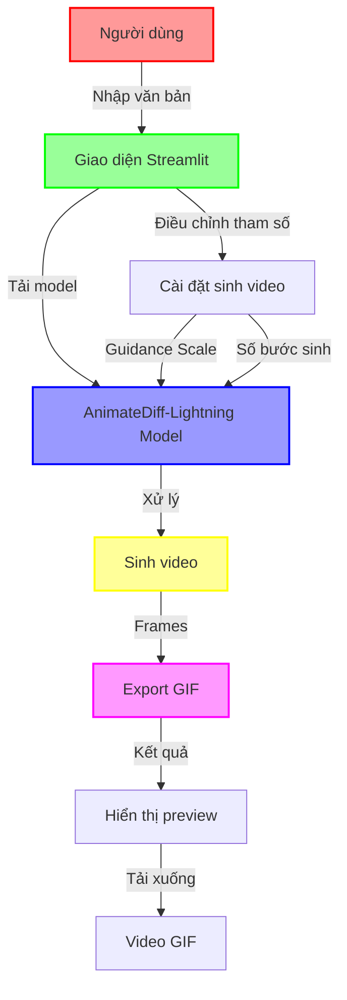

# 🌸 Anime Text-to-Video Generator 🌸

<div align="center">

[](https://www.python.org/downloads/)
[](https://streamlit.io/)
[](LICENSE)

</div>

## ✨ Tổng Quan

Anime Text-to-Video Generator là một ứng dụng web tương tác được xây dựng bằng Streamlit, cho phép người dùng tạo video anime từ mô tả văn bản. Ứng dụng sử dụng mô hình AnimateDiff-Lightning để tạo ra các animation đẹp mắt theo phong cách anime.

## 🎯 Tính Năng Chính

- 🎨 Giao diện người dùng thân thiện với theme anime
- 🔄 Chuyển đổi text thành video anime
- ⚙️ Tùy chỉnh các thông số sinh video
- 🌓 Hỗ trợ chế độ sáng/tối
- 📥 Tải xuống video định dạng GIF
- 🎬 Xem trước kết quả trực tiếp

## 🚀 Cài Đặt

1. Chạy ứng dụng:
```bash
streamlit run text2video.py
```

## 💻 Yêu Cầu Hệ Thống

- Python 3.9 trở lên
- CUDA-compatible GPU (khuyến nghị)
- RAM: tối thiểu 8GB
- Dung lượng ổ cứng: 5GB trở lên

## 🛠️ Công Nghệ Sử Dụng

- **Frontend**: Streamlit
- **AI Model**: AnimateDiff-Lightning

## 📝 Hướng Dẫn Sử Dụng

1. Khởi động ứng dụng
2. Nhập mô tả video bạn muốn tạo
3. Điều chỉnh các thông số trong sidebar
4. Nhấn nút "Tạo Video"
5. Đợi quá trình xử lý hoàn tất
6. Tải xuống kết quả

## 🎨 Tùy Chỉnh

- Guidance Scale: 0.1 - 2.0
- Số bước sinh: 1 - 8
- Theme: Sáng/Tối

## 🔄 Quy Trình Hoạt Động



## 🔍 Chi Tiết Quy Trình

1. **Input**: 
   - Người dùng nhập mô tả văn bản
   - Điều chỉnh các tham số (Guidance Scale, số bước)

2. **Xử Lý**:
   ```mermaid
   sequenceDiagram
       participant U as User
       participant S as Streamlit UI
       participant M as Model
       participant G as GPU

       U->>S: Nhập văn bản
       S->>M: Tải model
       M->>G: Chuyển xử lý GPU
       G->>M: Sinh frames
       M->>S: Tạo GIF
       S->>U: Hiển thị kết quả
   ```

3. **Output**:
   - Preview video
   - Tải xuống định dạng GIF

## 📄 License

MIT License - Xem file [LICENSE](LICENSE) để biết thêm chi tiết

## 🤝 Đóng Góp

Mọi đóng góp đều được chào đón! Hãy tạo pull request hoặc mở issue để thảo luận về những thay đổi bạn muốn thực hiện.

## 📧 Liên Hệ

- GitHub: [BaoHan1712](https://github.com/BaoHan1712)

---

<div align="center">
Made with ❤️ by [BaoHan1712]
</div>

